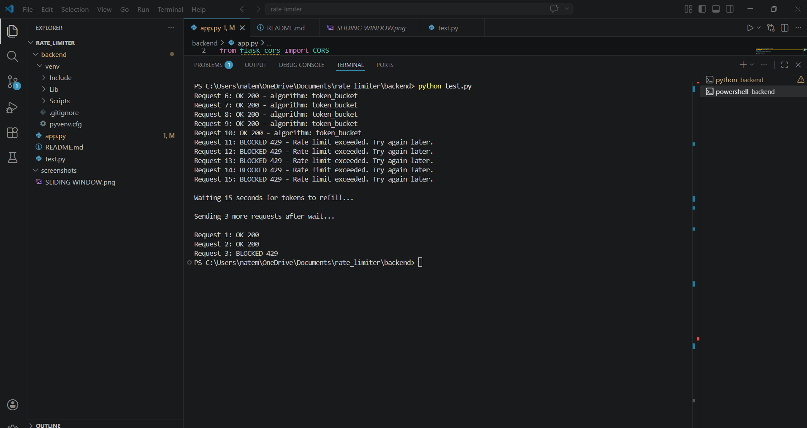
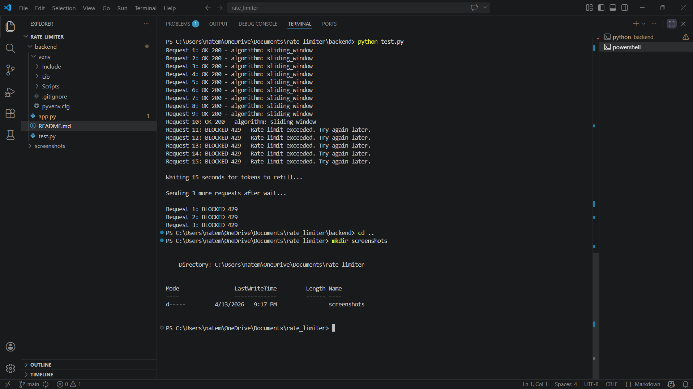

API Rate Limiter

Flask API with two rate limiting algorithms built to understand how production APIs control traffic.

Why I built this

Rate limiting is something every real API uses — AWS, Stripe, you name it. I wanted to actually implement it and understand the tradeoff between algorithms, not just read about it.

Algorithms

Sliding Window
Tracks exact request timestamps in a rolling time window. Strict — once you hit the limit you're locked out until the full window clears. No partial recovery.

Token Bucket
Each IP gets a bucket of tokens that refills continuously over time. More forgiving — if you wait a bit you get some tokens back without waiting for the full window to reset.

## Setup

```bash
git clone https://github.com/natemcc20/API_RATE_LIMITER.git
cd API_RATE_LIMITER
python -m venv venv
venv\Scripts\activate
pip install -r requirements.txt
python app.py
```

## Testing

```bash
python test.py
```

Fires 15 requests at the API (10 go through, 5 get blocked), waits 15 seconds, then sends 3 more. The post-wait results show exactly where the two algorithms differ — token bucket lets some through, sliding window blocks all of them.

## Configuration

All tweakable at the top of app.py:
- `ALGORITHM` — swap between 'sliding_window' and 'token_bucket'
- `MAX_REQUESTS` — how many requests allowed per window
- `WINDOW` — window size in seconds
- `BUCKET_CAPACITY` — max tokens in the bucket
- `REFILL_RATE` — how fast tokens refill


## Screenshots

**Token Bucket** — partial recovery after 15 second wait


**Sliding Window** — all requests blocked after 15 second wait
